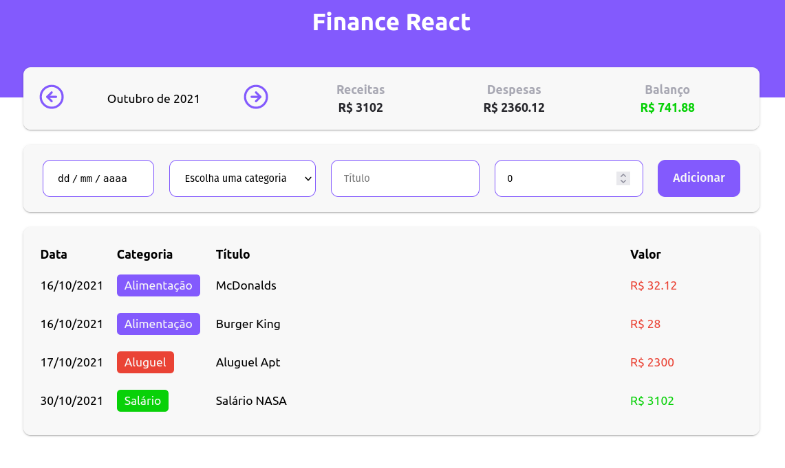

<h1 align="center">Finance React</h1>

    <a href="#introduction">Introdução</a>&nbsp;&nbsp;&nbsp;|&nbsp;&nbsp;&nbsp;
    <a href="#tecnologies">Tecnologias</a>&nbsp;&nbsp;&nbsp;|&nbsp;&nbsp;&nbsp;
    <a href="#install">Instalação</a>&nbsp;&nbsp;&nbsp;

 

  

<h3 id="introduction">🏁 Introdução</h3>

A aplicação consiste em se cadastrar ganhos e despesas da sua conta pessoal, com uma filtragem por data.

<h3 id="tecnologies">🚀 Tecnologias</h3>

- [React JS](https://pt-br.reactjs.org)
- [TypeScript](https://www.typescriptlang.org)
- [Styled-Components](https://styled-components.com)

<h3 id="install">&#128187; Como instalar?</h3>

1. Clone o repositório usando o `git clone`
2. Entre na pasta do projeto
3. Execute o comando `npm install` para instalar as dependências
4. Rode a aplicação com o comando `npm start` ou se preferir `yarn start`

<h6>
    Follow me on social media 
    
    
    
</h6>

